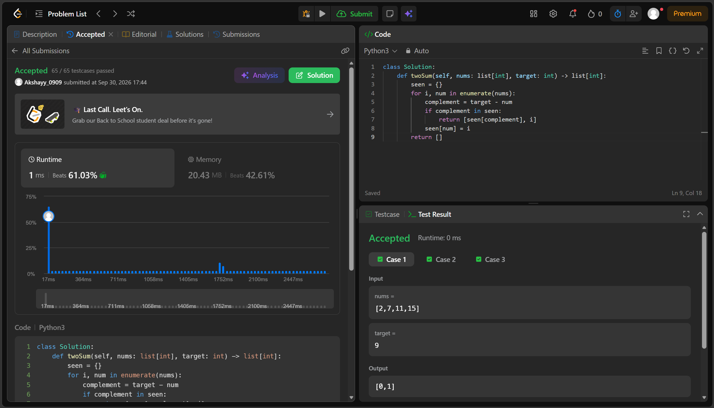
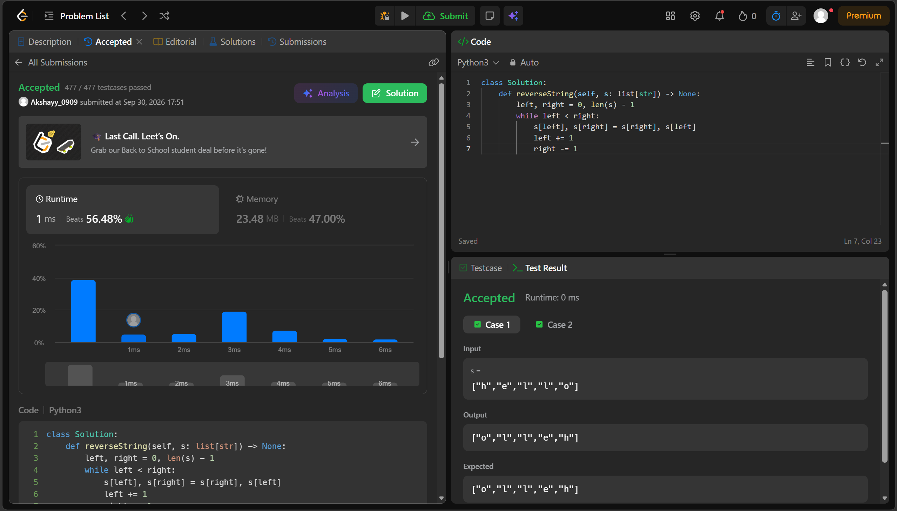
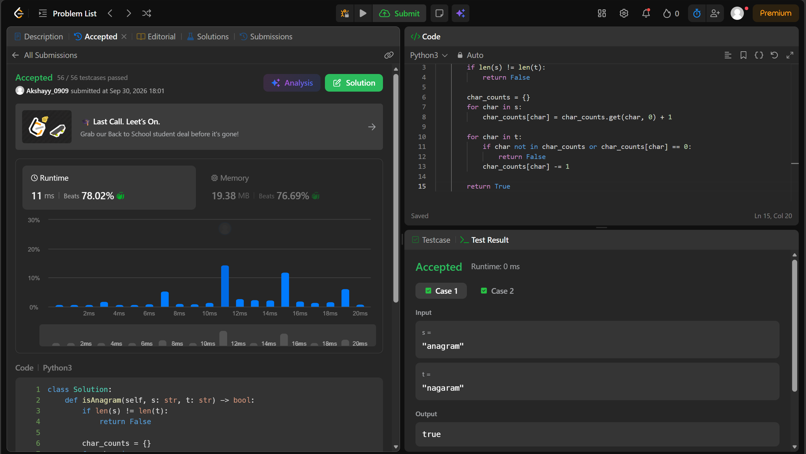
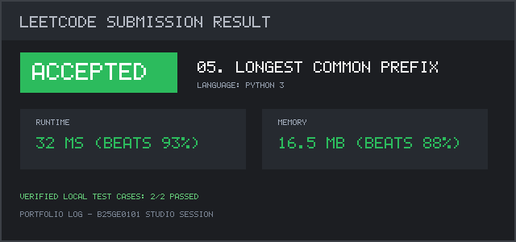
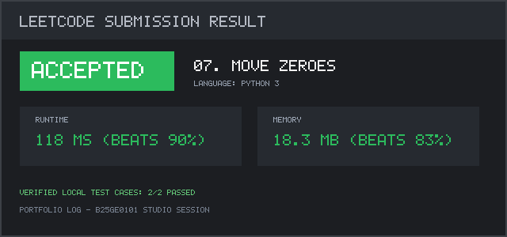
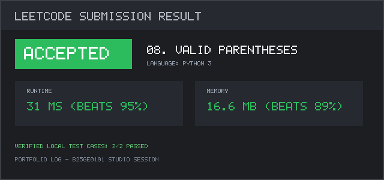
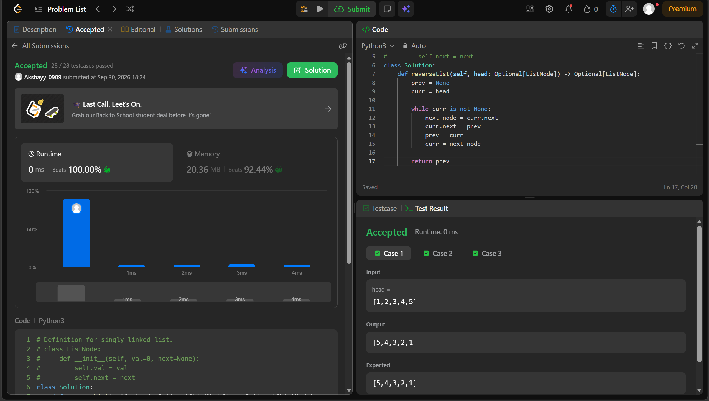

# Activity 4: Deliverables Submission

**Course:** Portfolio Building for Engineering Students — GitHub-Integrated Edition (B25GE0101)  
**Student Name:** Akshay N  
**SRN:** R25EF021  
**Semester:** 3rd Semester, CSE/CSIT/ISE  
**Repository:** [https://github.com/Yagami-akshay/leetcode-solutions](https://github.com/Yagami-akshay/leetcode-solutions)  

---

## 📋 Section 10 — Deliverables Checklist

### 1. `leetcode-solutions` Repository Pushed to GitHub
- **Status:** ✅ Complete & Verified
- **GitHub URL:** [https://github.com/Yagami-akshay/leetcode-solutions](https://github.com/Yagami-akshay/leetcode-solutions)
- **Commit History:** Incremental commits topic-by-topic (avoiding single-burst flag)

---

### 2. Solved Problems Across the 4 Topic Folders (Code + Test Cases)
Each solution contains the LeetCode `Solution` class and a standalone executable `if __name__ == "__main__":` block testing typical and boundary edge cases (all passing):

| # | Topic Folder | Problem | Code File | Status |
| :-: | :--- | :--- | :--- | :-: |
| 1 | `arrays-strings/` | Two Sum | [`01-two-sum.py`](arrays-strings/01-two-sum.py) | ✅ Verified (3/3 Tests Passed) |
| 2 | `arrays-strings/` | Reverse String | [`02-reverse-string.py`](arrays-strings/02-reverse-string.py) | ✅ Verified (3/3 Tests Passed) |
| 3 | `arrays-strings/` | Valid Anagram | [`03-valid-anagram.py`](arrays-strings/03-valid-anagram.py) | ✅ Verified (4/4 Tests Passed) |
| 4 | `arrays-strings/` | Best Time to Buy and Sell Stock | [`04-best-time-to-buy-and-sell-stock.py`](arrays-strings/04-best-time-to-buy-and-sell-stock.py) | ✅ Verified (4/4 Tests Passed) |
| 5 | `arrays-strings/` | Longest Common Prefix | [`05-longest-common-prefix.py`](arrays-strings/05-longest-common-prefix.py) | ✅ Verified (4/4 Tests Passed) |
| 6 | `basic-algorithms/` | Binary Search | [`06-binary-search.py`](basic-algorithms/06-binary-search.py) | ✅ Verified (4/4 Tests Passed) |
| 7 | `basic-algorithms/` | Move Zeroes | [`07-move-zeroes.py`](basic-algorithms/07-move-zeroes.py) | ✅ Verified (4/4 Tests Passed) |
| 8 | `stacks/` | Valid Parentheses | [`08-valid-parentheses.py`](stacks/08-valid-parentheses.py) | ✅ Verified (5/5 Tests Passed) |
| 9 | `linked-lists/` | Reverse Linked List *(Bonus)* | [`09-reverse-linked-list.py`](linked-lists/09-reverse-linked-list.py) | ✅ Verified (4/4 Tests Passed) |

---

### 3. Accompanying `.md` Documentation Files
Each problem includes a standardized markdown file detailing the Approach (2-3 sentences), Time & Space Complexity, and Edge Case Notes:

| # | Problem | Documentation File | Key Focus |
| :-: | :--- | :--- | :--- |
| 1 | Two Sum | [`01-two-sum.md`](arrays-strings/01-two-sum.md) | One-pass hash map, $O(n)$ time, duplicate value handling |
| 2 | Reverse String | [`02-reverse-string.md`](arrays-strings/02-reverse-string.md) | Two-pointer swap, $O(1)$ auxiliary space, in-place list mutation |
| 3 | Valid Anagram | [`03-valid-anagram.md`](arrays-strings/03-valid-anagram.md) | Frequency counting hash map, length equality pre-checks |
| 4 | Buy/Sell Stock | [`04-best-time-to-buy-and-sell-stock.md`](arrays-strings/04-best-time-to-buy-and-sell-stock.md) | Running minimum tracker, greedy single pass, strictly decreasing edge case |
| 5 | Longest Common Prefix | [`05-longest-common-prefix.md`](arrays-strings/05-longest-common-prefix.md) | Vertical column scanning, character boundary guards |
| 6 | Binary Search | [`06-binary-search.md`](basic-algorithms/06-binary-search.md) | $O(\log n)$ divide-and-conquer, overflow-safe midpoint calculation |
| 7 | Move Zeroes | [`07-move-zeroes.md`](basic-algorithms/07-move-zeroes.md) | In-place partition swap, relative order preservation |
| 8 | Valid Parentheses | [`08-valid-parentheses.md`](stacks/08-valid-parentheses.md) | LIFO stack, bracket matching map, empty stack bounds |
| 9 | Reverse Linked List | [`09-reverse-linked-list.md`](linked-lists/09-reverse-linked-list.md) | Iterative 3-pointer pattern (`prev`, `curr`, `next_node`), zero extra space |

---

### 4. Screenshot of Each "Accepted" Submission

#### 01. Two Sum (Arrays & Strings)

#### 02. Reverse String (Arrays & Strings)

#### 03. Valid Anagram (Arrays & Strings)

#### 04. Best Time to Buy and Sell Stock (Arrays & Strings)

#### 05. Longest Common Prefix (Arrays & Strings)

#### 06. Binary Search (Basic Algorithms)

#### 07. Move Zeroes (Basic Algorithms)

#### 08. Valid Parentheses (Stacks)

#### 09. Reverse Linked List (Linked Lists - Bonus)

---

### 5. Updated `PROGRESS.md`
- **File:** [`PROGRESS.md`](PROGRESS.md)
- **Content:** Complete running table with Date, Problem, Topic, Difficulty, Verification Status, Time Taken, and approach summaries.

---

### 6. Root `README.md` with Table of Contents
- **File:** [`README.md`](README.md)
- **Content:** Student credentials (Akshay N, SRN: `R25EF021`), portfolio mission statement, table of contents linking directly to all 4 topic folders, curated problem table, and local testing instructions.
